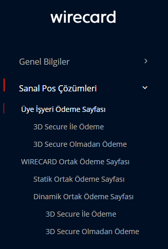
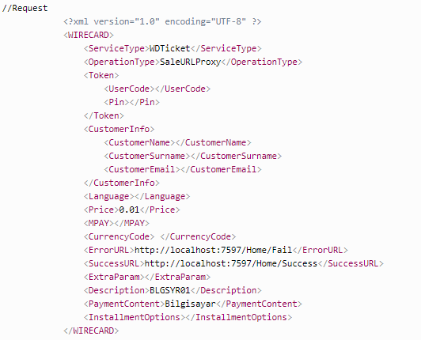
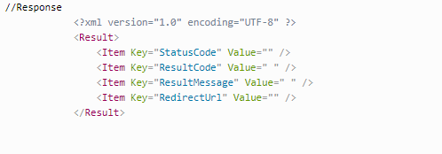

# Kart ile ödeme işlemleri
## Wirecard Nedir?
Wirecard internet üzerinden yapılacak alışverişlerde kredi kartı ile ödeme yapılmasını sağlayan pos servisidir. Buna benzer bankaların da sunduğu servisler vardır. 

Web sitenizde satış yapmak isterseniz bu servisleri kullanabilirsiniz. Yapmanız gereken 
[Wirecard](https://www.wirecard.com.tr/) 'ın sitesine girerek sitenin sunduğu servisi ücret karşılığı alabilirsiniz. Alma işleminden  sonra nasıl sitenize entegre olacağını anlatacam.

## Başlayalım..
İlk olarak [Wirecard](https://www.wirecard.com.tr/) 'ın sitsine girelim. Geliştirici bölümüne tıklayalım.


Daha sonra Entegrasyona başlaya tıklayarak devam edelim. Menü kısmından SanalPos Çözümleri kısmından hangi türde ödeme istediğinizi belirleyin.

`Eğer 3D kullanmak istiyorsanız 3D Secure ile Ödeme seçeneğini kullanın.`



Dinamik ödemede wirecard kart bilgileri girmek için size otamatik arayüzünü sunuyor. Eğer siz kendi arayüzünüzü oluşturmak isterseniz statik ödeme seçeneğini seçebilirsiniz.

Ben `Dinamik Ortak Ödeme` seçeneği üzerinden devam edeceğim.
(Ödeme işlemlerinin adam adım olması taraftarı olduğum için bunu daha mantıklı buluyorum)

### Şimdi Kodlamaya Başlayalım..

Wirecard servisi bizden xml tarzında request ister ve sonucunda response döndürür. Yani bizden kullanıcı adı, ödenecek ücret, işlem başarılı ve başarıszı olduğğu durumlarda gidilmesi gereken sayfa uzantı  bilgilerini xml şeklinde servise request yapmamızı ister.





 Bunu sonucunda hata var ise hata mesajını, hata yok ise bize responseUrl gönderir.


 


  Bu gelen url ile sitenin sunduğu ödeme sayfasına yönlendir. Bu kısımdan sonra gerçekleşecek işlemler wirekard ile kullanıcı arasındadır. 

  Bir çok yazılım dilleri ile projenize entegre edebilirsiniz. Ben php de nasıl yapıldığını anlatacam.

`Bir sonraki adımı daha iyi anlamanız için wirecard'ın sitesindeki değişkenleri incelemenizi tavsiye ederim.`

````php
//BaseModel.php
class Token
{
    public $UserCode; 
    public $Pin;
    public $BaseUrl;
}
class Product
{
    public $ProductId; 
    public $ProductCategory; 
    public $ProductDescription; 
    public $Price; 
    public $Unit;    
}
class Input
{
    public $Content; 
    public $Gsm;
    public $RequestGsmOperator; 
    public $RequestGsmType; 
    public $MPAY; 
    public $SendOrderResult; 
    public $PaymentTypeId; 
    public $ReceivedSMSObjectId; 
    public $ProductList;
    public $SendNotificationSMS; 
    public $OnSuccessfulSMS;
    public $OnErrorSMS; 
    public $Url; 
    public $SuccessfulPageUrl; 
    public $ErrorPageUrl; 
    public $Country; 
    public $Currency; 
    public $Extra;
    public $TurkcellServiceId;
    public $CustomerIpAddress;
    public $BeginDate;
    public $EndDate;
    public $ProductId;
    public $OrderChannelId;
    public $Active;
    public $SubscriberType;
    public $StartDateMin;
    public $StartDateMax;
    public $LastSuccessfulPaymentDateMin;
    public $LastSuccessfulPaymentDateMax;
    public $SubscriberId;
}
class CreditCardInfo
{
    public $CreditCardNo;
    public $OwnerName;
    public $ExpireYear;
    public $ExpireMonth;
    public $Cvv;
    public $Price;
}
````

Gönderilecek olan xml dosyasına bilgileri class yapısı ile eklememiz gerekiyor. Bu yüzden class modellerimizi oluşturuyoruz.


````php

    $request = new WDTicketPaymentFormRequest();
    $request->ServiceType = "WDTicket";
    $request->OperationType = "Sale3DSURLProxy"; //Bu kısım seçtiğiniz ödeme tipine göre  değişiyor.

    
    $request->Token= new Token();// Token classı üste gösterdiğimiz basemodel den geliyor bu yüzden import etmeyi unutmayın.
    $request->Token->UserCode="";
    $request->Token->Pin="";
    $request->BaseUrl = ""; 
    //Üst kısımdaki Token bilgileriniwirecard ın size özel verdiği bilgiler ile doldurmanız gerekmektedir.
    
    
    $request->Price = 1;//0.01 TL Ücret kısmı buraya eklenmeli
    
    $request->CardTokenization = new CardTokenization();// CardTokenization classı üste gösterdiğimiz basemodel den geliyor bu yüzden import etmeyi unutmayın
    $request->CardTokenization->RequestType = 0;
    $request->CardTokenization->CustomerId = "0";
    $request->CardTokenization->ValidityPeriod = 0;
    $request->CardTokenization->CCTokenId = "";
    
    $request->MPAY = "";
    $request->InstallmentCount = 0;
    $request->CurrencyCode ="TRY";
    $request->ErrorURL = ""; //hata oluştuğunda göndermek isteginizz sayfa
    $request->SuccessURL = "";//işlem başarılı oluştuğunda göndermek isteginiz sayfa
    $request->ExtraParam = "";
    $request->PaymentContent = "";//bu kısımları siteden inceleyin
    $request->Description = "";
    $request->PaymentTypeId = 1;
    $request->IPAddress = ""; //ip adresini alarak buraya ekleme yapın
    
    $response = WDTicketPaymentFormRequest::execute($request); //Bu kısımda olusturulan bilgiler xml formatına cevrilir ve servise request gönderilir.Gelen sonuc $response olarak alınır. 
    $sxml = new SimpleXMLElement($response);//Gelen Response xml formatına cevrilir.
    $responseUrl=$sxml->Item[3]['Value']; // Üstte gösterdiğimiz response degişkenlerinin 3. degeri responseUrl'di. Bunu da aldıktan sonra kullanıcıyı bu url e yönlendiririz.

````

````php
//WDTicketPaymentFormRequest.php
use GuzzleHttp\Client;
use GuzzleHttp\Psr7\Request;

class WDTicketPaymentFormRequest
{
    public  $ServiceType; 
    public  $OperationType; 
    public  $Price; 
    public  $Token; 
    public  $MPAY; 
    public  $CurrencyCode; 
    public  $Description; 
    public  $ErrorURL; 
    public  $SuccessURL; 
    public  $ExtraParam; 
    public  $PaymentContent; 
    public  $PaymentTypeId; 
    public  $BaseUrl;
	public  $CustomerInfo; 
    public  $Language; 
    
    public static function Execute(WDTicketPaymentFormRequest $request)
    {
        return  restHttpCaller::post($request->BaseUrl, $request->toXmlString());
        /*ResthttpCaller classı alt resimde gösterilecek.WDTicketPaymentFormRequest.php den gelen bilgiler burada xml formatına dönüştürülerek servise post istegi gönderiyor. Gelen sonucu tekrar WDTicketPaymentFormRequest.php ye gönderyor */
    }    

      public function toXmlString()
    {
         $xml_data = "<?xml version=\"1.0\" encoding=\"UTF-8\"?>\n" .
        "<WIRECARD>\n" .
        "    <ServiceType>" . $this->ServiceType . "</ServiceType>\n" .
        "    <OperationType>" . $this->OperationType . "</OperationType>\n" .
        "    <Token>\n" .
        "    <UserCode>" .$this->Token->UserCode . "</UserCode>\n" .
        "    <Pin>" .$this->Token->Pin . "</Pin>\n" .
        "    </Token>\n" .
        "    <CreditCardInfo>\n" .
        "    <CreditCardNo>" . $this->CreditCardInfo->CreditCardNo . "</CreditCardNo>\n" .
        "    <OwnerName>" . $this->CreditCardInfo->OwnerName . "</OwnerName>\n" .
        "    <ExpireYear>" . $this->CreditCardInfo->ExpireYear . "</ExpireYear>\n" .
        "    <ExpireMonth>" . $this->CreditCardInfo->ExpireMonth . "</ExpireMonth>\n" .
        "    <Cvv>" . $this->CreditCardInfo->Cvv . "</Cvv>\n" .
        "    <Price>" . $this->CreditCardInfo->Price . "</Price>\n" .
        "    </CreditCardInfo>\n" .
		"    <CustomerInfo>\n" .
        "    <CustomerName>" . $this->CustomerInfo->CustomerName . "</CustomerName>\n" .
        "    <CustomerSurname>" . $this->CustomerInfo->CustomerSurname . "</                CustomerSurname>\n" .
        "    <CustomerEmail>" . $this->CustomerInfo->CustomerEmail . "</CustomerEmail>\n" .
        "    </CustomerInfo>\n" .
        "    <CardTokenization>\n" .
        "    <RequestType>" . $this->CardTokenization->RequestType . "</RequestType>\n" .
        "    <CustomerId>" . $this->CardTokenization->CustomerId . "</CustomerId>\n" .
        "    <ValidityPeriod>" . $this->CardTokenization->ValidityPeriod . "</ValidityPeriod>\n" .
        "    <CCTokenId>" . $this->CardTokenization->CCTokenId . "</CCTokenId>\n" .
        "    </CardTokenization>\n" .
        "    <Language>" . $this->Language . "</Language>\n" .
        "    <MPAY>" . $this->MPAY . "</MPAY>\n" .
        "    <InstallmentCount>" . $this->InstallmentCount . "</InstallmentCount>\n" .
        "    <IPAddress>" . $this->IPAddress . "</IPAddress>\n" .
        "    <MPAY>" . $this->MPAY . "</MPAY>\n" .
        "    <CurrencyCode>" . $this->CurrencyCode . "</CurrencyCode>\n" .
        "    <Description>" . $this->Description . "</Description>\n" .
        "    <ErrorURL>" . $this->ErrorURL . "</ErrorURL>\n" .
        "    <SuccessURL>" . $this->SuccessURL . "</SuccessURL>\n" .
        "    <ExtraParam>" . $this->ExtraParam . "</ExtraParam>\n" .
        "    <PaymentContent>" . $this->PaymentContent . "</PaymentContent>\n" .
        "    <PaymentTypeId>" . $this->PaymentTypeId . "</PaymentTypeId>\n" .
        "</WIRECARD>";
        $xml_data = iconv("UTF-8","ISO-8859-9", $xml_data);
        return $xml_data;
    }

````


````php
//restHttpCaller.php
class restHttpCaller 
{
    private $curl;

	
    public static function get($url)
    {
        $ch = curl_init($url);
        curl_setopt($ch, CURLOPT_SSL_VERIFYHOST, 0);
        curl_setopt($ch, CURLOPT_SSL_VERIFYPEER, 0);
        curl_setopt($ch, CURLOPT_POST, 1);
        curl_setopt($ch, CURLOPT_RETURNTRANSFER, 1);
        $output = curl_exec($ch);
        curl_close($ch);
        return $output;
    }
   
    public static function post($url, $content)
    {
        $ch = curl_init($url);
        curl_setopt($ch, CURLOPT_SSL_VERIFYHOST, 0);
        curl_setopt($ch, CURLOPT_SSL_VERIFYPEER, 0);
        curl_setopt($ch, CURLOPT_POST, 1);
        curl_setopt($ch, CURLOPT_POSTFIELDS, $content);
        curl_setopt($ch, CURLOPT_RETURNTRANSFER, 1);
        $output = curl_exec($ch);
        curl_close($ch);
        return $output;
    }
}
````


> **Note:** Bu dosyaları birbirlerine import etmeyi unutmayın!!


